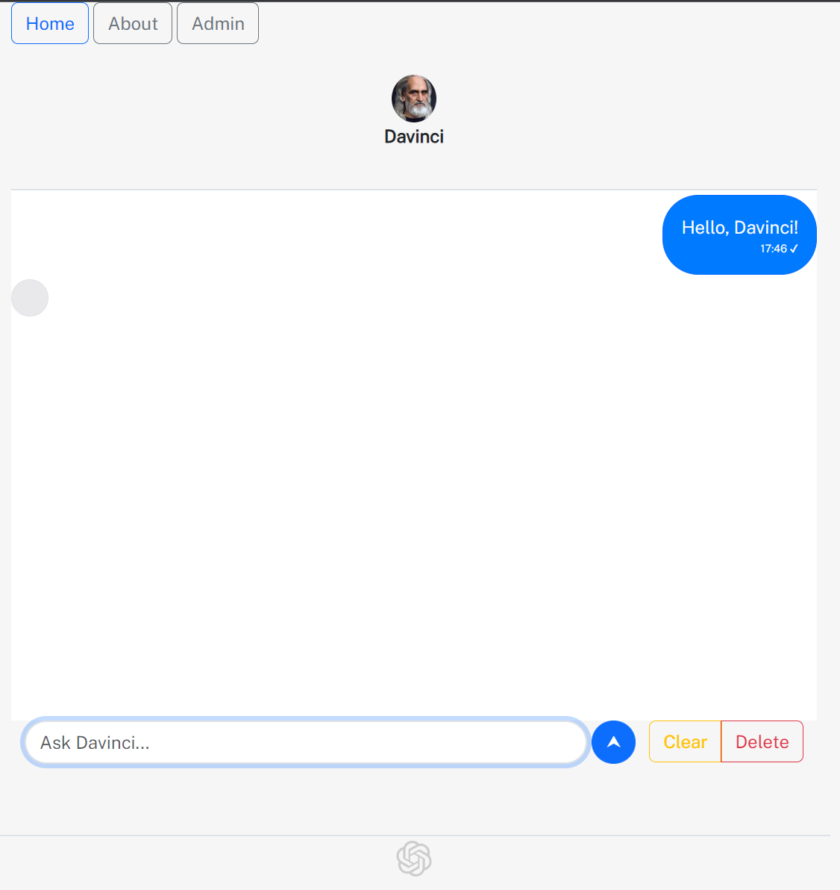

# OpenAI App
###### Powered by


# Table of Contents
- [OpenAI App](#openai-app)
- [Table of Contents](#table-of-contents)
- [About](#about)
- [Prerequisites](#prerequisites)
- [Setup](#setup)
- [Demo](#demo)
- [Licensing](#licensing)
- [Contribution](#contribution)


# About

This is a toy app submitted as a final product for a web-development course.  
It provides a "chatting" experience with the text-davinci-003 language model using OpenAI's [public API](https://platform.openai.com/docs/api-reference/completions/create?lang=node.js).  
Every such correspondence is saved as a log document in the backend's noSQL database.


# Prerequisites

- An OpenAI account.
- [Node.js]()
- [MongoDB Community Server](https://www.mongodb.com/try/download/community)
- [MongoDB Compass](https://www.mongodb.com/try/download/compass)

*Note: Download MongoDB Community Server first, then in the installation de-check the Compass installation option since it is bugged (as of time of writing).  
Then, download and install Compass separately.


# Setup

In ./server/ create a new file "secret.js" with the following content and all placeholders replaced to appropriate values:

```js
const user = 'PLACEHOLDER'; // username to login into administrative section
const pass = 'PLACEHOLDER'; // password to login ...
const secret = 'PLACEHOLDER'; // some secret, could be a random string
const org = 'PLACEHOLDER'; // OpenAI personal organization string
const key = 'PLACEHOLDER'; // OpenAI API key

module.exports = {
  user,
  pass,
  secret,
  org,
  key
}
```
*Note: you can find your account's API key [here](https://platform.openai.com/account/api-keys), and your organization ID [here](https://platform.openai.com/account/org-settings).


Run the following commands by order:

```powershell
git clone https://github.com/yuval-ro/openai-app.git
npm upgrade
npm install
npm start
nodemon ./server/index.js
```

The React app will run on port 3000, while the server on 3001.

In a web browser, navigate to http://localhost:3000/ and test the app.

*Note: if you receive a status code 429 from the API, that means you have exhausted the request limit.


# Demo




# Licensing

This repository is licensed under [GPLv3](./LICENSE)


# Contribution

Currently, we accept any code contributions.
